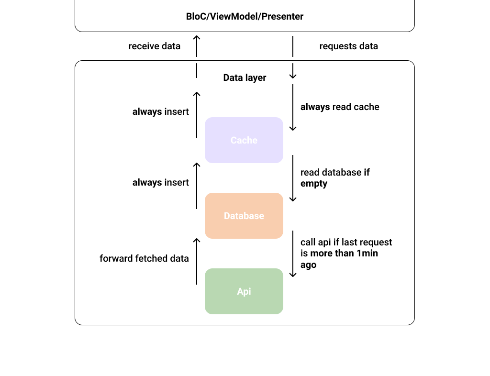

# DeDaLa - Declarative Data Layer

DeDaLa is a library that helps you create complex data layers that contains multiple asynchronous data sources such as caches, databases or network requests. 
DeDaLa abstracts this complexity lets you define data flows in a declarative way!


### Example
Lets imaging a data layer that should:
1. Read the cache
2. If the cache is empty, read the database
3. Get the latest data from the api if last request is older than 1 minute
4. Save fetched data in the database & cache

  
```dart
  var userDeDaLa = DeDaLa<int, User>()
      .connectCache(source: memoryCache)
      .connect(
          readFrom: (id) => database.getUser(id),
          readPolicy: ReadPolicy.IfDownstreamEmpty(),
          insertTo: (int id, User user) => database.insertUser(user))
      .connect(
          readFrom: (id) => api.requestUser(id),
          readPolicy: ReadPolicy.Gated(duration: Duration(minutes: 1)));

  userDeDaLa.get(myUserId).listen((user) {
    // handle result
  });
```

Most clean architecture examples define a view logic component (BloC/ViewModel/Presenter) that requests data from a Service or Data Layer. 
This Data Layer can be responsible for network requests, caching or providing offline data from a database. The data flow of the given example could look like this:



### Principles 
The Api was design to match the visual representation of the image above. 
Every ````connect```` / ````connectCache```` will create a layer that has its own read and insert rules defined by a Policy.
Every Layer is represented by a ````Cache```` that is able to ````get(key)```` and ````set(key, value)```` data.
````DeDaLa```` itself composes those layers and implements ````Cache```` itself.

This means that your logic component only depends on a simple ````Cache```` to get the data from. This makes mocking and testing easy!

### Customization
You can easily control when to read or insert your data by using a different ````ReadPolicy```` or ````InsertPolicy````.
DeDaLa provides all the basic Polices but you can easily create your own!

```dart
class UserReadPolicy {
  
  /// This read policy only reads if
  /// - the previous fetched user does not exists
  /// - the email is is not null
  static ReadPolicy<int, User> IfEmailValid() =>
      ConditionalReadPolicy<int, User>(
        // if this returns true the data will be read
        readCondition: (optionalUser) =>
            optionalUser.isNotPresent || optionalUser.value.email != null,
      );
}
```

If you need more control you can always implement ```ReadPolicy``` or ````InsertPolicy```` and provide a cache connector.


----
- Describe very briefly but clearly what the project does.
- State if it is out-of-the-box user-friendly, so it’s clear to the user.
- List its most useful/innovative/noteworthy features.
- State its goals/what problem(s) it solves.
- Note and briefly describe any key concepts (technical, philosophical, or both) important to the user’s understanding.
- Note its development status.
- Include badges.

----------

TODO:
- Principles
- Cache interface & Default cache implementation
- ReadPolicy
- InsertPolicy
- Custom Policies
- Recommend compile safety flag
- add roadmap with new features such as exception handling, file caching