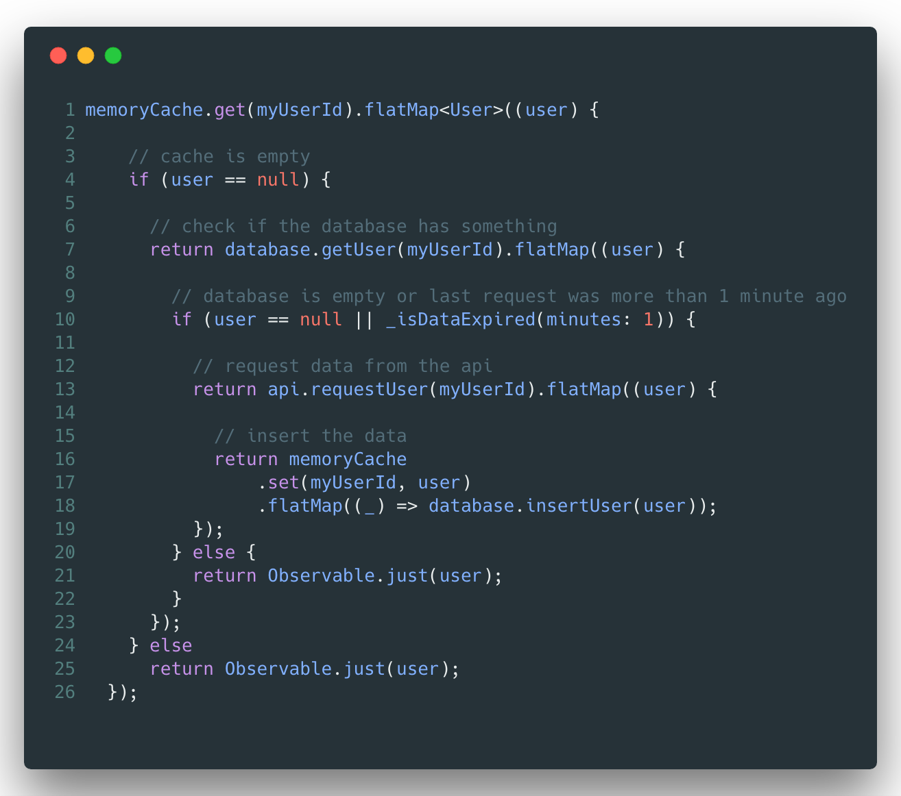
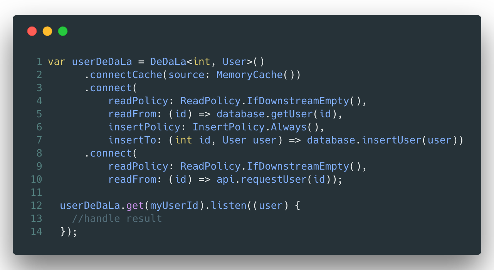

# DeDaLa - Declarative Data Layer

DeDaLa is a library that helps you manage complex data layers that contains multiple asynchronous data sources such as caches, databases or network requests. 
DeDaLa abstracts this complexity and provides an api that lets you define data flows in a declarative way!

## Example
  |  

----------
1. Read the cache
2. If the cache is empty &rarr; read the database
3. If last api request is older than 1 minute &rarr; call the api
4. Once the data is fetched &rarr; save in database and cache

TODO:
- Mention compile safety flag
- add roadmap with new features such as exception handling